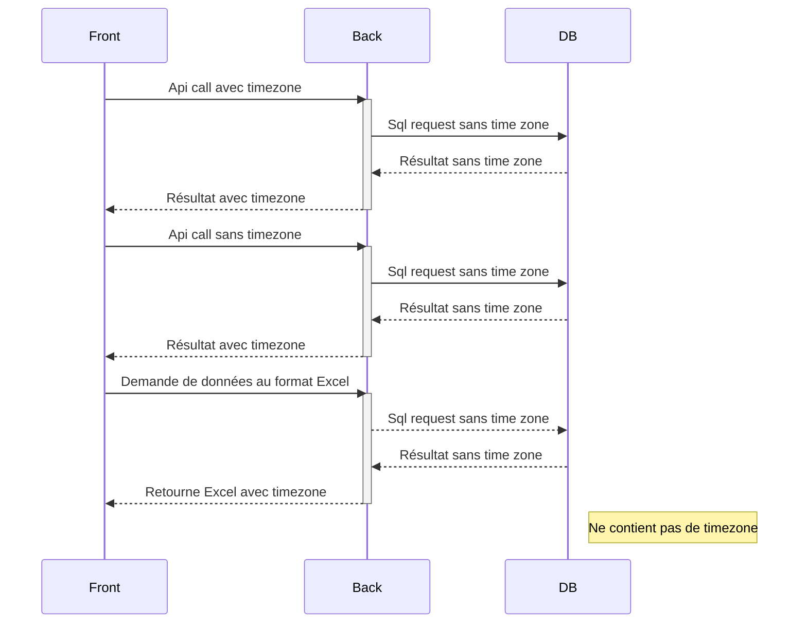
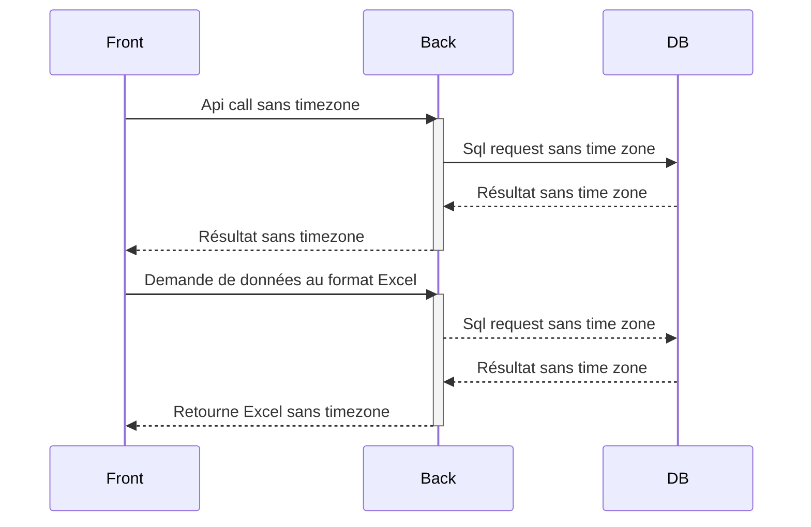

- 📅 Date : 07/03/2022
- 👷 Décision prise par : Squad

# Contexte

Pour de nombreuses raisons (bonnes et mauvaises), nous n'avons pas de gestion harmonisée des timezones dans notre application :
- Dans le frontend, le fuseau horaire dépend de l'utilisateur, mais pour le moment les utilisateurs sont tous situés en
  France.
- Une partie des requêtes API sont réalisées avec un fuseau horaire explicite pour les dates, une partie sans
  spécification du fuseau horaire.
- Les machines qui hébergent le BACKEND sont en UTC. Cependant, lorsque les devs font tourner le backend sur leur PC, il
  est en UTC+01.
- Il est possible de demander au Back end de générer des fichiers Excel avec les données, pour permettre à l'utilisateur
  de les télécharger.

Quelques autres éléments de contextes :
- Notre base de données contient des séries temporelles en UTC sans fuseau horaire explicite.
- Le backend est organisé en architecture hexagonale avec une partie interface (les routes d'API), une partie domaine (
  le sens métier), une partie infrastructure (interaction avec la base de donnée).
- La base de données contient un volume important (plusieurs centaines de Giga) de données historiques.

L'état actuel des appels peut-être représenté comme cela :

# Options envisagées 💡

1. Le backend ne traite que l'UTC et ne prend pas en compte les fuseaux horaires.
    - ✅ **Avantages :**
        - Pas besoin de se soucier de la localisation des utilisateurs et il n'y a qu'une seule "référence" (
          l'application utilise le format UTC
          uniquement)
        - Pas besoin de se soucier de l'endroit où le backend est déployé.
        - Réduit un peu les calculs lors de la conversion des fuseaux horaires.
    - 🚫 **Inconvénients :**
        - Nous devons remanier certains services frontaux pour envoyer les heures UTC.
        - Dans le frontend il faut convertir les résultats du Back donnés en UTC vers l'heure locale.
        - Comment gérer la timezone dans l'Excel généré alors que le back n'a pas conscience du fuseau horaire de
          l'utilisateur

2. Fuseaux horaires dans l'API et le domaine, mais pas dans l'infrastructure (la base de données n'a pas de fuseau
   horaire).
    - ✅ **Avantages :** Pas besoin de modifier les données dans la base de données
    - 🚫 **Inconvénients :** Le backend n'est pas homogène

3. Fuseaux horaires partout, ainsi que dans la DB
    - ✅ **Avantages :** Nous n'en identifions pas
    - 🚫 **Inconvénients :** Beaucoup de travail de refactoring, et besoin de modifier complètement la DB pour stocker les
      dates.

# Decision 🏆

L'équipe a décidé de l'option 1 : **Le backend ne traite que l'UTC et ne prend pas en compte les fuseaux horaires**.

Le diagramme de flux final une fois l'option mise en place sera le suivant :

# Conséquence

- Refactorer le backend pour supprimer le code qui gère les timezones
- Refactorer le frontend pour qu'il fasse des appels API uniquement en UTC et s'occupe d'afficher les dates dans la
  timezone de l'utilisateur.
